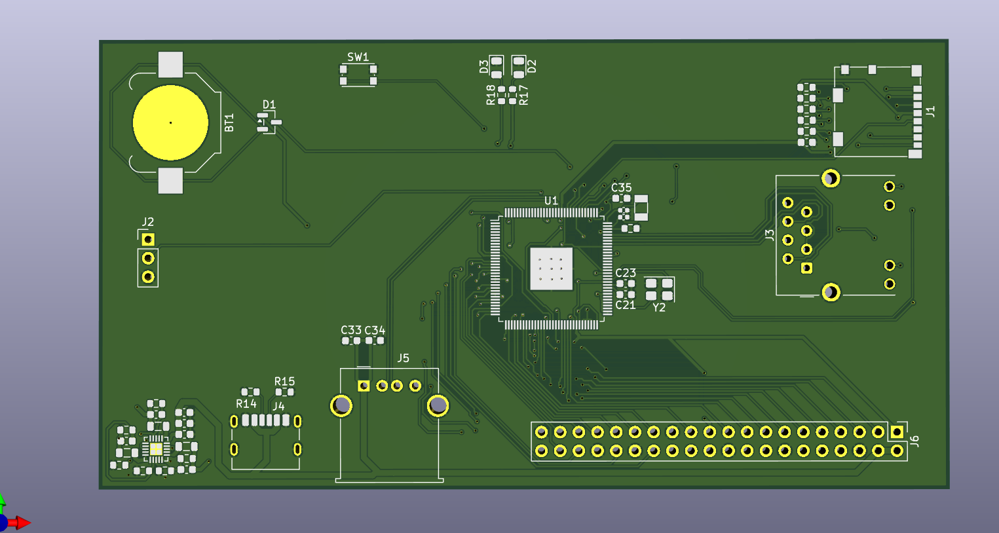
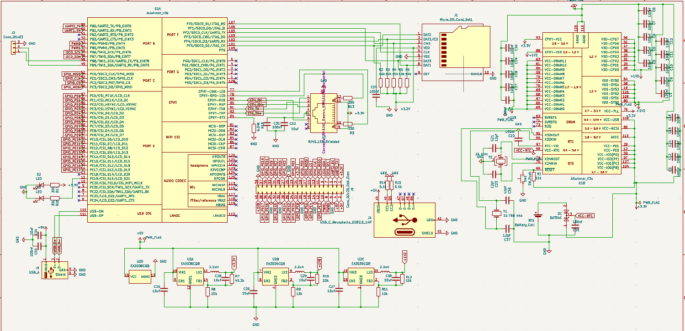
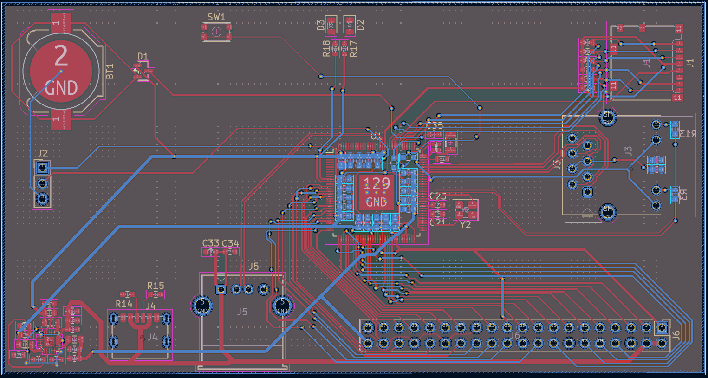

# Custom Linux Single Board Computer

Open-source hardware design for a minimal **Allwinner V3s**-based Single Board Computer, designed with **KiCad 9.0**.

## Features

- **Allwinner V3s** — ARM Cortex-A7 @ 1.2 GHz with **64 MB integrated DDR2 RAM** (SiP)
- **EA3036CQB** PMIC — 3-channel regulator (1.2V / 1.8V / 3.3V) from 5V input
- **10/100 Ethernet** — integrated PHY in V3s + RJ45 with magnetics (Hanrun HR911105A)
- **USB Type-C** — power input (5V) and USB OTG
- **USB Type-A** — host port
- **microSD** card slot (Molex 104031-0811, push-push) — boot and storage
- **Debug UART** — 3-pin 2.54mm header for serial console
- **GPIO header** — 2x20 pin, Raspberry Pi-like pinout
- **CR1220** coin cell holder — RTC backup
- **Boot/reset button**

## Gallery

| 3D View | Schematic | PCB Layout |
|---------|-----------|------------|
|  |  |  |

## Board Specifications

| Parameter | Value |
|-----------|-------|
| Layers | 4 |
| Dimensions | 115.6 × 61.2 mm |
| PCB thickness | 1.6 mm |
| Copper finish | ENIG (gold) |
| Min track width | 0.15 mm |
| Min clearance | 0.15 mm |
| Via size | 0.6 mm / 0.3 mm drill |

## Repository Contents

| File / Folder | Description |
|---------------|-------------|
| `Allwinner V3s.kicad_sch` | Schematic |
| `Allwinner V3s.kicad_pcb` | PCB layout |
| `Allwinner V3s.kicad_pro` | KiCad project file |
| `production/` | Gerbers, BOM, pick-and-place, netlist |
| `Allwinner V3s-backups/` | Design backups |

## Production Files

The `production/` folder contains everything needed for PCB fabrication and assembly:

- `Allwinner_V3s.zip` — Gerber files + NC drill
- `bom.csv` — Bill of Materials with LCSC part numbers
- `positions.csv` — Pick-and-place centroid data
- `netlist.ipc` — IPC-356 electrical test netlist

## Status

- **DRC**: 1 warning (local footprint override, non-critical)

## License

Open hardware — use, modify, and manufacture at your own risk.
